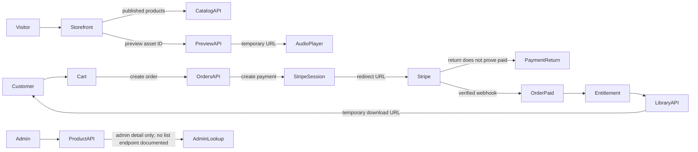

# MedTheG Frontend Design Direction

**Status:** Superseded exploratory proposal. Use [medtheg-frontend-design-specification.md](medtheg-frontend-design-specification.md) as the final source of truth. No production frontend implementation is included here.

## Product and API constraints

MedTheG is a digital music-production storefront for beats, kits, courses, and bundles. The frontend is a React 19 + TypeScript + Vite web app. It will call the existing REST API through a typed client; API DTOs and actual server states remain authoritative.

Key constraints reflected throughout this proposal:

- Public catalog queries expose published products only. Product list responses include identifiers, title, description, type, price, currency, status, categories, cover and preview asset IDs, and asset references with only `id` and `type`.
- Preview audio is obtained from the preview endpoint as an expiring URL (15 minutes). Treat it as a short-lived playback source and request a fresh URL when needed.
- Protected storage keys and permanent file URLs must never appear in the UI or client state.
- Orders are created with `POST /api/orders`; a Stripe Checkout Session is then created with `POST /api/orders/{orderId}/payment`, and the browser navigates to the returned `checkoutUrl`.
- The Stripe redirect does not prove payment. Only server-confirmed order/payment state is authoritative. The documented customer API currently has order listing, but no individual order or payment status endpoint; do not invent one.
- The library is based on active entitlements. Downloads return a temporary URL after access is checked. A separate streaming/delivery workflow is not part of the current backend.
- Product creation, editing, publish/archive, and asset endpoints exist. The documented API has no admin product-list endpoint. Do not imply an all-products list or search exists until an endpoint is added.
- Product upload currently accepts multipart field `file` and returns `{ assetId, storageKey }`. The separate add-asset endpoint accepts `{ type, storageKey }`. The upload response therefore exposes a storage key to the admin client; keep it out of rendered UI, logs, analytics, and persistence, and retain it only as long as needed for the add-asset request. If the requirement is that the browser must never receive a storage key, the backend contract needs to change before implementing upload.
- `PUT /api/products/{id}` updates title, description, type, price, and categories; it does not accept explicit cover/preview IDs. Asset add accepts type and storage key. Confirm how cover/preview assignment is derived from asset types before designing assignment controls; do not promise manual assignment unsupported by the contract.

## 1. Design concept

**Afterhours Pressing Room**: a brutalist editorial archive where each release is treated like a black-vinyl pressing. The storefront combines a near-black listening room with high-contrast typography, monochrome photography and grain, and precise audio controls. Product artwork remains in its original colors; every interface surface and state stays strictly grayscale. Product information remains easy to scan; expressive layouts live in scale, composition, texture, and pacing rather than ornamental UI effects.

The experience should feel authored and music-literate. Use real product artwork as a source of character, while keeping all surrounding UI monochrome. Avoid inventing claims such as BPM, key, license terms, track length, file sizes, or instructor details unless the API later provides them.

## 2. Brand system

### Color palette

| Token | Value | Use |
|---|---|---|
| `mono-1000` | `#000000` | Deep black panels and occasional full-bleed sections |
| `mono-950` | `#0A0A0A` | Main page background |
| `mono-900` | `#141414` | Header and raised structural surfaces |
| `mono-800` | `#242424` | Inputs, player bed, selected rows |
| `mono-700` | `#3A3A3A` | Borders on dark surfaces |
| `mono-600` | `#666666` | Muted UI details; use only where contrast permits |
| `mono-400` | `#A3A3A3` | Secondary text on dark backgrounds |
| `mono-200` | `#D6D6D6` | High emphasis text on dark backgrounds |
| `mono-100` | `#F5F5F5` | Light panels and primary text |
| `mono-0` | `#FFFFFF` | High contrast surfaces and inverse interaction states |

This palette is grayscale only: each token has equal red, green, and blue channels. Use the dark scheme by default, with occasional white editorial panels to reset the eye. Product artwork can introduce its own colors only inside the actual artwork image boundary; UI chrome, overlays, borders, controls, statuses, notifications, shadows, and gradients remain monochrome. Gradients, when useful for image legibility, must be grayscale. No colored glows or shadows.

### Typography

- **Display:** `Space Grotesk` (600–700), used for oversized editorial headlines, category names, and selected prices. Prefer locally bundled/licensed files where available; otherwise use a reliable sans-serif fallback.
- **Interface/body:** `DM Sans` (400–600), for navigation, product details, controls, and longer descriptions.
- **Technical metadata:** `IBM Plex Mono` (400–500), for category labels, asset types, dates, playback time, and compact numeric values.
- **Scale:** 12 / 14 / 16 / 18 / 24 / 32 / 48 / 72–104px display, with fluid display sizing. Body text starts at 16px on small screens, line height 1.5; long text measure 60–75 characters.
- Keep all caps for short labels only. Avoid tracking out paragraphs or using mono for body copy.

### Space, shape, depth, and borders

- Base spacing follows 4px increments, with common steps 4 / 8 / 12 / 16 / 24 / 32 / 48 / 64 / 96.
- Content gutters: 20px mobile, 32px tablet, 48–72px desktop. Main content max width: about 1440px; reading copy stays narrower.
- Radius philosophy: mostly square, 2–6px for controls and panels; artwork can use 0px. Use pill shapes only for filter chips or compact status labels.
- Prefer one-pixel borders and tonal surface shifts to shadows. Use black or neutral-gray shadows only when an overlay needs separation; no colored glow or shadow.
- Surface hierarchy: `mono-950` canvas, `mono-900` structural regions, `mono-800` controls/selected rows, monochrome photo treatments, and occasional white panels.

### Motion, hover, and interaction

- Motion is a cue: 120–180ms for control feedback, 220–320ms for panel/route transitions, slower image reveals only for hero/editorial moments.
- Use opacity and small translations; avoid layout-changing animation, scroll hijacking, perpetual ambient movement, and mandatory parallax.
- Reduced motion removes reveals and waveform movement while preserving state changes.
- Hover may reveal secondary actions on pointer devices, but all essential actions remain visible or keyboard/touch reachable.
- Buttons use direct verbs (“Play preview”, “Add to cart”, “Continue to Stripe”, “Download files”). One dominant CTA per view. Default primary is black with white text; hover/focus may invert to white with black text. Secondary uses a transparent/dark surface and gray or white border. Destructive actions use explicit text, an icon, confirmation, and a stronger grayscale border.
- Interaction states use only grayscale contrast, opacity, brightness, border thickness, and background inversion. Focus uses a visible white or black outline selected for contrast against the local surface. Disabled states remain distinguishable without relying on color.
- Inputs have persistent labels, visible focus rings, clear help/error text, and strong filled/disabled/loading states. Placeholders are examples only.

### Image and product-card language

- Artwork is the product’s visual anchor: square crop, fixed aspect ratio, high quality, consistent object-fit, and no ornamental frame unless artwork itself includes one.
- Do not apply a global duotone or heavy filter; preserve creator artwork. Use a quiet matte surface for missing covers and a small “Artwork unavailable” label.
- Product listings use an editorial grid, not a grid of rounded elevated cards. Each item shows artwork, title, product type/category, price/currency, and an optional preview control when `previewAssetId` exists.
- Use title wrapping up to two lines; do not invent metadata to fill whitespace. Hover can reveal a play affordance or underline, without hiding the title or price.

### Audio-player visual language

The player is a compact studio transport strip: clear play/pause, a thin progress track, sparse waveform ticks, current time/duration, and volume. The active item title and artwork remain legible. White marks the played portion against a charcoal track; use weight, shape, and labels to distinguish active playback. No animated equalizer is required. All progress seeking has a keyboard-operable slider alternative and a textual time readout.

### Navigation language

Desktop navigation is a slim masthead with wordmark, category links, search, and account/cart actions. It remains in document flow until sticky behavior materially helps a long listing. Mobile uses a compact top bar and an accessible full-screen or bottom sheet menu. Do not use a crowded row of icons or an app-style side rail on the public store.

### Monochrome state language

The grayscale rule applies to every state, not just the default theme. Loading uses monochrome skeleton bands or a white/gray spinner; errors and destructive actions use explicit wording, a consistent icon, and a stronger border; success and confirmation use a checkmark plus text; warnings use an icon and concise label. Toasts, badges, dialogs, empty states, selected filters, and validation messages follow the same grayscale tokens. Do not add colored backgrounds, status dots, gradient tints, glows, or shadows. Depth comes from alternating black/charcoal/gray/white planes, photographic grain, restrained blur, border weight, typography, and asymmetric composition. A grayscale grain or gradient may sit behind content, but must preserve text contrast and never imitate a colored light source.

## 3. Route map

Routes marked “guarded” require a logged-in customer or admin role. Preserve query strings and browser history for search/filter state.

| Route | Access | Purpose and API relationship |
|---|---|---|
| `/` | Public | Editorial storefront, curated product queries, category discovery, featured preview. Uses public published catalog data. |
| `/beats` | Public | Published product list filtered by the `BEATS` category/type supported by the API. Search/filter/sort are URL-backed. |
| `/kits` | Public | Published product list for kits. |
| `/courses` | Public | Published product list for courses. |
| `/bundles` | Public | Published product list for bundles. |
| `/products/:id` | Public | Product detail, preview, price, categories, assets references, purchase action. Draft/archived/missing responses render unavailable state. |
| `/search` | Public | Optional canonical search results page using `search` and `category` query parameters; can be folded into `/beats` etc. if navigation stays simpler. |
| `/login` | Public | `POST /api/auth/login`; retain intended destination for guarded routes. |
| `/register` | Public | `POST /api/auth/register`; registration does not return a token, so explain that the customer must then log in. |
| `/cart` | Public/customer | Client-side cart review and quantity/remove actions; catalog prices are revalidated by order creation. |
| `/checkout` | Customer | Create order then payment session and redirect to `checkoutUrl`. This page does not collect card data. |
| `/payment/success` | Customer | Explain that confirmation is processing; never show “paid” from redirect alone. Link to order history/library and provide refresh/retry messaging. With no order status endpoint, do not promise live confirmation; update UI only from authoritative data available through the API. |
| `/payment/cancel` | Customer | Explain checkout was canceled/returned; provide a return-to-cart action. Do not claim the order was deleted or payment state changed. |
| `/orders` | Customer | Paginated order history from `GET /api/orders`; show returned order/payment state fields only. |
| `/library` | Customer | Active entitlement collection from `GET /api/library`, with product metadata and asset grouping. The current library DTO does not include `coverAssetId`, so artwork requires a safe published-product enrichment or a backend DTO change. |
| `/library/:productId` | Customer | Focused purchased product and its downloadable assets; use only fields returned by the library DTO (entitlement/product/order IDs, title, description, type, price, currency, grantedAt, and asset IDs/product IDs/types). |
| `/admin` | Admin | Admin landing, available create action, and guidance to open a known product by ID. No fabricated dashboard metrics. |
| `/admin/products` | Admin | Product management entry point. Current API cannot populate an all-products table; display a create action and ID lookup/edit path, and mark broader listing as requiring an API capability. |
| `/admin/products/new` | Admin | Create a draft using `POST /api/products`, then continue to its editor. |
| `/admin/products/:id` | Admin | Draft/published/archived detail via `GET /api/products/admin/{id}`; asset management and lifecycle actions. |
| `/admin/products/:id/edit` | Admin | Edit title, description, type, price, categories and asset assignments using the documented update endpoint. |
| `*` | Any | Branded not-found screen with a route back to catalog. |

Avoid a customer `/orders/:id` route until the API exposes individual order retrieval. The public `/products/:id` remains distinct from the admin detail route. Admin route guards are role-aware; a customer who lacks access receives a clear access-denied route rather than a silent redirect loop.

## 4. Homepage concept and wireframe

```text
┌──────────────────────────────────────────────────────────────┐
│ WORDMARK     BEATS  KITS  COURSES  BUNDLES   SEARCH  BAG     │
├──────────────────────────────────────────────────────────────┤
│ ISSUE 01 / INDEPENDENT PRODUCTION GOODS                       │
│                                                              │
│ MAKE ROOM             Oversized editorial title              │
│ FOR THE               with hard line breaks and              │
│ LOW END.              one concise producer-led sentence.      │
│                       [Explore latest drop ↗]                 │
│                                              FEATURE ART       │
│                                              [play preview]    │
├──────────────────────────────────────────────────────────────┤
│ NOW PLAYING / FEATURED RELEASE — title, category, price, play │
│ ━━━━━━━━━━━━━━━━━━━━━━━●━━━━━━━━━━━━━━━━━━━━ time / volume   │
├──────────────────────────────────────────────────────────────┤
│ LATEST PRESSINGS       Editorial section title / Browse all   │
│ [large artwork] [product] [product]                            │
├──────────────────────────────────────────────────────────────┤
│ FOUR ENTRY POINTS: BEATS / KITS / COURSES / BUNDLES            │
│ typography-led strips with image fragments, not four tiles     │
├──────────────────────────────────────────────────────────────┤
│ THE TOOLBOX             A contrasting, asymmetric kit/course   │
│ editorial feature       feature using real catalog items       │
├──────────────────────────────────────────────────────────────┤
│ New arrivals list / selected creator note only if real content │
└──────────────────────────────────────────────────────────────┘
```

Above the fold: masthead, statement, one featured product/preview interaction, and a clear exploration path. The first scroll shifts into a release-listing rhythm with large art and compact metadata. Editorial copy should be short and producer-specific (“Build the next session around a better source.”), not generic conversion claims. Every homepage slot falls back gracefully if no matching published products are returned; do not hardcode IDs as permanent featured content.

## 5. Product page concept

The desktop product view is an asymmetric two-column composition: artwork and player on the left, purchase information on the right. Keep title, category/type, price/currency, and primary action visible without scrolling on common laptop heights where feasible. A description follows, then an asset overview based only on allowed asset metadata, then related products from catalog queries.

```text
BEATS / PRODUCT                                    01 — RELEASE
┌───────────────────────────────┐  TITLE
│                               │  Beat / category labels
│       COVER ART               │  € price
│                               │  [Add to cart]
└───────────────────────────────┘  Preview player if previewAssetId
                                   Description
                                   Included files: types only when known
                                   Related releases
```

“Purchase state” is client/session state (already in cart) until a purchase is confirmed through order/library data. Do not display “owned” unless active entitlement/library data confirms it. If the preview URL expires or errors, request a new URL on the next play attempt and show a recoverable state. Asset references expose type and ID; do not show filenames, sizes, license details, or storage paths unless the backend explicitly exposes them.

## 6. Audio UX and reusable audio system

- **Product preview:** Play requests a short-lived preview URL, enters loading, then playing. Show buffering/error states and a retry action. If unavailable, keep purchase and product information usable.
- **Global player:** One active track at a time, persisted across route changes while the app session remains mounted. Product pages and the mini-player control the same playback instance rather than starting duplicates.
- **Transport:** Play/pause, seek/progress, elapsed and total time, mute/volume, active title and stop/close where appropriate. Seeking uses a labeled slider; keyboard arrows adjust in small increments, Home/End jump, Space toggles when focus is on the play control.
- **Waveform:** Prefer a deterministic visual progress trace generated from time/progress or use a simple segmented bar; the API does not provide waveform data. No claim that an invented waveform represents the actual audio signal. Provide a reduced-motion static variant.
- **Mobile:** Compact sticky mini-player above page content with a minimum 48px control hit area; expanded sheet for seeking and volume. Reserve bottom padding so content and focus are not hidden.
- **Lifecycle:** Stop or explicitly retain playback when starting another preview; release media resources when the player closes. Refresh expired preview URLs on demand. Avoid autoplay.
- **Accessibility:** Native audio semantics where practical; visible labels/tooltips, `aria-pressed` for play state, slider name/value text, live announcements only for meaningful state changes, and no time announcement every second.

## 7. Cart, checkout, and payment return UX

Cart state is client-side and can be stored locally for continuity. Each row contains artwork, title, category, unit price/currency, quantity and remove. Cart totals are estimates until the server creates the order. Handle empty cart, stale/unavailable product, duplicate product, pending submission, and request failure. Prevent double-submit.

Checkout is a two-step API action: create order with the current product IDs/quantities, then request payment. On a payment-session error, retain the cart and explain how to retry; on success, navigate to the returned checkout URL. Do not collect payment details in MedTheG.

The success route uses calm “We’re confirming your payment” language, a non-alarming processing indicator, and a refresh action. Because there is no individual order status lookup documented, do not simulate polling or infer payment from URL parameters. The order history/library may become available after webhook processing; explain a brief delay and present those destinations. Cancel returns to cart with its contents intact. Do not present a canceled redirect as an authoritative failed payment.

## 8. Customer library UX

The library is a private vault, visually quieter than the storefront: product title, purchase metadata (`grantedAt`, order ID) and grouped asset type rows. The current library response does not include artwork IDs; either render typographic product entries or enrich with the public product endpoint only where it is available (published products), or request a library DTO enhancement. “Download” requests a fresh URL, then opens it; describe the link as temporary if the interface exposes its short lifetime. Distinguish requesting a link from transfer completion because the API returns a presigned URL and does not proxy or report download progress.

States: loading skeletons; empty vault with browse CTA; downloadable assets; unavailable/expired-link retry; authentication required; authorization/not-found error. Do not expose signed URLs beyond the immediate download action, persist them, or claim an asset is owned without library data. For `library/:productId`, derive detail from the library payload unless an explicitly documented endpoint is added.

## 9. Admin UX

Keep the same dark editorial canvas and typography, with denser tables/forms and grayscale interaction states. Use a distinct “Studio / Admin” breadcrumb or masthead label so context is clear, not an unrelated generic SaaS shell.

- Create a draft and show its returned ID/status.
- Edit product fields with inline validation and clear save feedback.
- Manage category assignment and asset types. Product responses include `coverAssetId` and `previewAssetId`, but the update DTO does not accept these IDs explicitly; do not offer independent cover/preview assignment controls unless the backend behavior is confirmed or its contract is extended.
- Upload uses multipart `file`, receives `{ assetId, storageKey }`, then adds the asset using `{ type, storageKey }`. The key is currently returned to the browser by the backend; never render, log, analyze, or persist it, and limit its lifetime in client memory. For a strict “never exposed to browser” security requirement, revise the backend flow before implementation.
- Asset rows show type and assigned role; remove actions require confirmation and explain impact.
- Publish action is enabled only with at least one category, matching the backend invariant. Confirm publish/archive and reflect returned/server state.
- Draft, published, and archived are textual badges with shape/border distinctions, not color-only. Archive is not deletion and should be described accurately.
- Since no product list endpoint is documented, `/admin/products` must be an honest entry/lookup surface, not a fake searchable table. Admin lookup by explicit ID uses `GET /api/products/admin/{id}`. The product listing API can only be used for published public results.

## 10. Responsive strategy

Design mobile first, then use consistent breakpoints near 640 / 768 / 1024 / 1440px.

| Area | Mobile | Tablet | Desktop |
|---|---|---|---|
| Navigation | Wordmark + menu and cart; sheet menu with category links/search/account | Compact inline links where space permits | Full masthead with categories, search, account/cart |
| Homepage | Vertical editorial sequence; hero art follows headline; one featured preview | Split hero, two-column release sections | Asymmetric art/text grid, three/four-column product rows |
| Catalog | Two columns where artwork remains clear; filter button opens sheet | Two/three columns and inline filters | Three/four columns, filter/sort rail at top |
| Product | Art → title/price/action → player/details; sticky bottom CTA only when it does not obscure player | Two-column art/info with stacked related items | Asymmetric 7/5 or 6/6 layout |
| Audio | Persistent compact bar with expanded sheet | Bottom mini-player | Full-width slim transport at viewport bottom only while active, with reserved space |
| Cart | Single-column rows and clear total/action | Two-column rows with summary | List plus sticky summary column |
| Checkout/return | Single focused state and readable external-checkout handoff | Same, centered content | Narrow status panel; no unnecessary checkout shell |
| Library | Artwork list and collapsible asset groups | Two-column product grid or list toggle | Grid with a focused detail pane when useful |
| Admin | Stacked labeled form, collapsible asset sections, full-width save action | Form with grouped sections | Narrow form column plus contextual status/actions |

At 375px, avoid horizontal overflow, maintain 16px body text, and keep controls at least 44×44px (prefer 48px for primary touch controls). Support landscape by returning to normal document flow rather than forcing a fixed player layout. Respect safe-area insets for persistent mobile player/CTA bars.

## 11. Accessibility strategy

- Target WCAG 2.2 AA. Verify actual foreground/background pairs: normal text 4.5:1, large text and meaningful control boundaries at least 3:1.
- Provide skip link, semantic landmarks, one `h1` per route, logical headings, visible 2–4px focus treatment, and focus that is not obscured by sticky UI.
- Use links for navigation and buttons for actions. Ensure full keyboard access and meaningful screen-reader names/states for icon controls.
- Artwork alt text should identify the product when informative; decorative duplicates use empty alt text. Do not make category or ownership status color-only.
- Forms use persistent labels, linked hint/error text, inline errors, an error summary for multi-field submission, and preserve input on failure. Auth allows paste/password managers and does not impose a puzzle.
- Audio never autoplays; every control works with keyboard and touch; announce loading/errors and playback state without noisy time updates.
- Honor `prefers-reduced-motion`; all motion has a static equivalent. Do not disable browser zoom.
- Test contrast independently on dark surfaces and artwork overlays; never place small copy directly over busy imagery without a solid backing.

## 12. Component architecture

Organize by feature, with shared primitives and API types separated from presentation:

```text
src/
  app/                 router, providers, route guards, app shell
  api/                 typed fetch client, DTOs, error normalization
  components/
    foundation/        Button, Field, Select, Dialog, Badge, Skeleton,
                       Toast, EmptyState, ErrorState, ConfirmAction
    navigation/        StoreHeader, MobileMenu, SearchForm, AccountMenu,
                       CartLink, Breadcrumbs
    catalog/           ProductArtwork, ProductRow, ProductGrid,
                       CatalogToolbar, FilterSheet, Pagination
    audio/             AudioProvider, PreviewController, MiniPlayer,
                       PlayerPanel, PlayButton, SeekSlider, WaveformTrace
    commerce/          CartLine, CartSummary, CheckoutStatus
    library/           LibraryProduct, AssetGroup, DownloadAction
    admin/             AdminShell, ProductEditor, AssetPicker,
                       AssetList, UploadControl, LifecycleActions
  features/            route-level queries/actions and page composition
  hooks/               reusable stateful behavior only
  state/               cart and audio client state
  styles/              tokens, reset, typography, motion utilities
```

Avoid wrappers that merely rename one HTML element. Product forms and asset workflows should be feature components; generic form controls stay in foundation. Use one consistent vector icon family (Phosphor is the UI/UX Pro default), at a small fixed size set and consistent stroke weight; no emoji icons.

## 13. State architecture

| State | Owner | Examples |
|---|---|---|
| Server state | TanStack Query | Catalog pages, product detail, admin product by ID, order history, library. Cache, retry, and invalidation stay query-managed. |
| Local page state | React | Open menu/dialog, current form draft, upload progress, transient errors, filter sheet visibility. |
| Shared client state | Zustand (small stores) | Cart lines; active audio track/playback UI; authenticated user/token session if no existing auth layer is present. Keep stores narrow and avoid copying query responses into them. |
| URL state | Router/search params | Search phrase, category, type, sort, direction, page. Back/forward restores browse context. |
| Browser/media state | Audio service/provider | Media element, active URL, current playback position, buffer/error status. Expiring URLs are runtime data and not persisted. |

The API contract does not document token refresh or logout endpoints. Keep auth handling deliberately small: persist credentials only according to the chosen security policy, attach bearer tokens in one client boundary, handle 401 consistently, and do not assume refresh-token support. Cart may be persisted locally but should be revalidated on order creation. Do not store library data permanently or store download/preview URLs.

## 14. Frontend folder architecture

The architecture above fits the existing Vite `frontend/src` application and its current React Router/TanStack Query dependencies. Start with a route shell, tokens, API client and common state, then add feature folders. Keep API DTOs near `src/api`; do not duplicate DTO definitions separately in each screen. Keep presentation components decoupled from fetch mechanics except for focused feature containers/hooks.

## 15. Implementation order after design approval

1. Resolve product/API decisions for secure asset upload, library artwork, explicit cover/preview assignment, admin product discovery, and authoritative payment-status retrieval. The current upload response contains a storage key, library DTO omits cover ID, and no admin list or individual order-status endpoint is documented.
2. Establish tokens, type styles, app shell, route map, focus treatment, responsive gutters, and common states.
3. Build typed API client, error normalization, auth boundary, TanStack Query provider, and route guards.
4. Implement product artwork, catalog card/list, URL-backed filters, and category pages.
5. Implement shared preview audio service and accessible mini-player; connect product preview endpoint with URL renewal.
6. Build homepage using live published catalog data and resilient editorial slots.
7. Add product detail and client cart.
8. Add order creation, payment-session redirect, and honest success/cancel states.
9. Add order history and entitlement library/download interaction.
10. Add admin product creation/edit/detail, lifecycle controls, and asset tools after verifying upload contract and admin discovery capability.
11. Refine responsive states and accessibility for each feature as it lands; do not leave all accessibility to a final pass.

## UI/UX Pro critique

The main template risks here are a conventional centered hero plus three equal cards, rounded floating cards, a neon waveform that exists only as decoration, or admin metric tiles without backend data. The proposal avoids these by treating catalog items as releases, using asymmetry sparingly, making the player an actual functional control, and constraining admin screens to real API capabilities. Guard against over-art direction: large type must not push product title/price/actions below the fold on mobile, artwork cannot carry essential metadata by itself, and editorial copy must not obstruct browse/search tasks.

## Architecture relationship sketch



This is a route/data relationship sketch, not a complete system diagram. The Graphify query was attempted against the existing graph, but its CLI could not resolve its installed Python path in this environment. The repository docs and API contract were used directly for the proposal.
